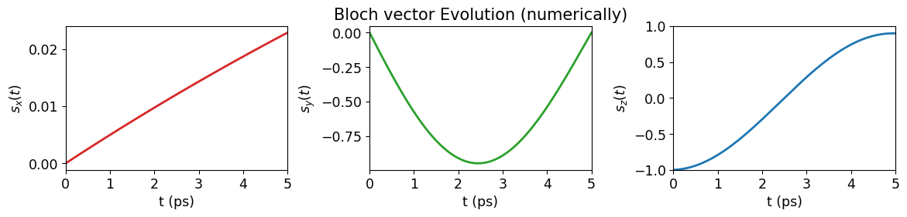
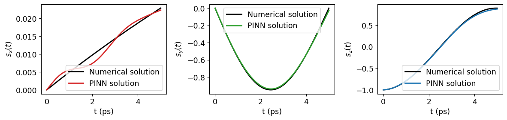
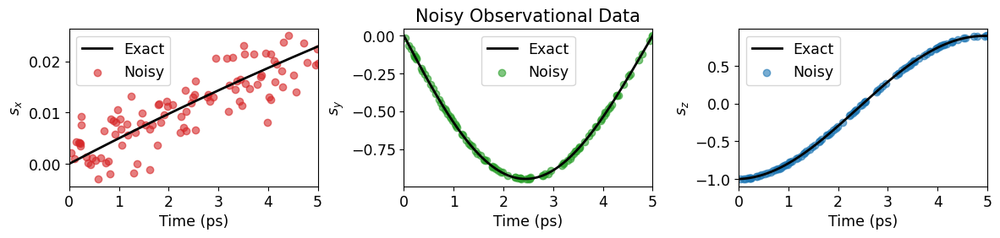
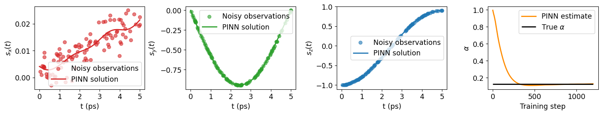
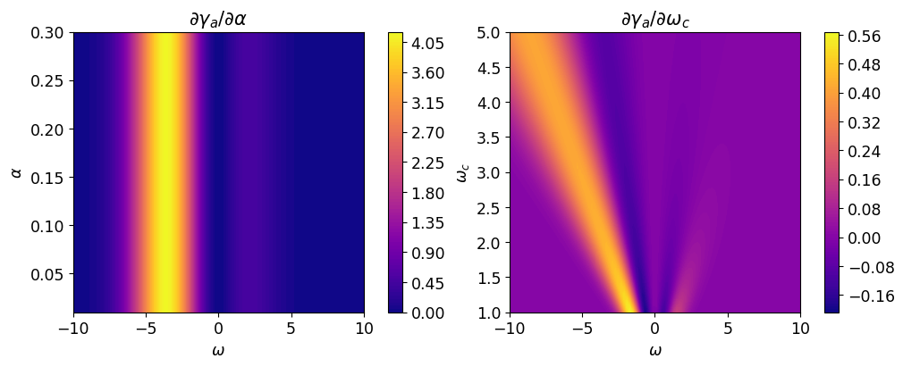

# PINN‑Lindblad: Physics‑Informed Neural Networks for Lindblad Master Equations

A fully reproducible implementation of **Physics‑Informed Neural Networks (PINNs)** for *learning* and *inverting* the **Bloch vectorised Lindblad master equation** governing population transfer in a *driven two‑level quantum system coupled to an acoustic‑phonon bath*.
This repository accompanies the manuscript *“Learning and inverting driven open quantum systems via physics-informed neural networks”* and includes simulation, inverse‑problem experiments, figures, and reproducible training pipelines.


## 🚀 Overview
This project demonstrates how PINNs can be used to:
*   **Task 1 — Forward Simulation:**
Learn the Bloch‑vector dynamics $\vec{s}(t)=[s_x(t),s_y(t),s_z(t)]$ of a quantum dot under a $\pi$‑pulse, using only the differential equations and boundary conditions.
* **Task 2 — Inverse Problem / Parameter Estimation:**
Infer the unknown bath coupling strength $\alpha$ (or cutoff frequency $\omega _c$) from sparse, noisy trajectory observations.
The PINN is implemented from scratch using ```PyTorch==2.9.0```, including custom autograd‑based time‑derivative computation and physics‑based loss construction.


## 📘 Physical Model
We study a two‑level system driven by a $\pi$‑pulse with Rabi frequency $\Omega (t)=\pi /\mathrm{pulse\  duration}$ and zero detuning $\Delta = 0$.
The Bloch vector evolves according to the generalized Lindblad master equation:

$\dot {s}_x=-\frac{\Omega }{\Lambda }(\gamma _a-\gamma _e)-\frac{\Delta ^2+2\Omega ^2}{2\Lambda ^2}(\gamma _a+\gamma _e)s_x-\Delta s_y+\frac{\Delta \Omega }{2\Lambda ^2}(\gamma _a+\gamma _e)s_z$ 

$\dot {s}_y=\Delta s_x-\frac{\gamma _a+\gamma _e}{2}s_y+\Omega s_z$

$\dot {s}_z=\frac{\Delta }{\Lambda }(\gamma _a-\gamma _e)+\frac{\Delta \Omega }{2\Lambda ^2}(\gamma _a+\gamma _e)s_x-\Omega s_y-\frac{2\Delta ^2+\Omega ^2}{2\Lambda ^2}(\gamma _a+\gamma _e)s_z$

where:
- $\Lambda =\sqrt{\Omega ^2+\Delta ^2}$
- $\gamma _a,\gamma _e$ are phonon absorption/emission rates
- $J(\omega )=2\alpha (\omega ^3/\omega_c^2) e^{-\omega ^2/\omega _c^2}$ is the super‑Ohmic spectral density
- $n_b(\omega )=1/(e^{\hbar \omega /k_B\Theta }-1)$ is the Bose–Einstein occupation number


## 🧠 PINN Architecture

The neural network approximates the Bloch vector coordinates at all times $t$:

$\mathcal{NN}(t;\mathbf{w})\approx [s_x(t),s_y(t),s_z(t)]$

**Loss Function:**
$\mathcal{L}=\mathcal{L_{\mathrm{boundary}}}+\mathcal{L_{\mathrm{physics}}}$

- **Boundary loss:** enforces initial boundary conditions
- **Physics loss:** enforces the Lindblad ODE residuals at collocation points
- **Inverse problem:** Uses data loss for the given observations and treats the bath parameter $\alpha/\omega_c$ as a learnable parameter
Gradients $\frac{d}{dt}NN(t)$ are computed using ```torch.autograd.grad()```.

## 📂 Repository Structure
```bash
pinn_lindblad/
│
├── data/                # Numerical solutions, noisy observations
├── figures/             # Plots for manuscript
├── train/               # Training scripts for simulation & inverse tasks
├── notebook.ipynb       # End-to-end demonstration
├── sensitivity.py       # Sensitivity analysis utilities
├── .gitignore
├── requirements.txt     # Python dependencies
└── README.md            # Project description

```

## 🛠️ Installation

```bash
git clone https://github.com/Sutirtha-github/pinn_lindblad

py -m venv venv 
# Windows (Powershell)
.\venv\Scripts\Activate.ps1

pip install -r requirements.txt
```


## ▶️ Running the Experiments

 The repository includes an end‑to‑end Jupyter notebook explaining and implementing the various stages of the workflow - from numerical simulation, data generation to PINN training and bath parameter estimation:
```bash
notebook.ipynb
```


## 📊 Results

The repository includes:
- Numerically simulated exact Bloch‑vector trajectories
- Bloch sphere visualization

- PINN learned trajectories (forward simulation)

- Synthetic noisy data generation

- Parameter‑estimation convergence curves (inverse learning)

- Sensitivity analysis for bath parameters


Figures are stored in ```figures/``` and generated automatically during training.


## 🧪 Reproducibility

This project includes:
- Fixed random seeds
- Deterministic PyTorch settings
- Version‑locked dependencies
- A reproducible release: PINN Lindblad v1.0 (Jan 19, 2026)

## 📄 Citation
If you use this code in your research, please cite the associated manuscript:
```
@article{Biswas_2026,
doi = {10.1088/2632-2153/ae4b84},
url = {https://doi.org/10.1088/2632-2153/ae4b84},
year = {2026},
month = {mar},
publisher = {IOP Publishing},
volume = {7},
number = {2},
pages = {025022},
author = {Biswas, Sutirtha and Paspalakis, Emmanuel},
title = {Learning and inverting driven open quantum systems via physics-informed neural networks},
journal = {Machine Learning: Science and Technology}
}
```


## 🤝 Contributions
Pull requests, issues, and discussions are welcome.
For major changes, please open an issue first to discuss what you’d like to modify.

## 📬 Contact
For questions or collaborations, feel free to reach out via GitHub Issues or the following emails.

*   Sutirtha Biswas: [sutibisw@ee.duth.gr](mailto:sutibisw@ee.duth.gr)
*   Emmanuel Paspalakis: [paspalak@upatras.gr](mailto:paspalak@upatras.gr)


